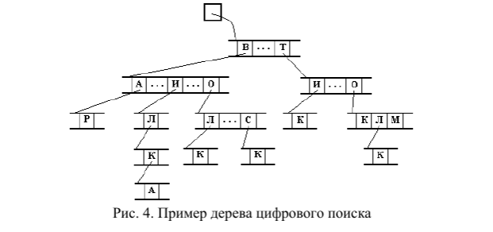
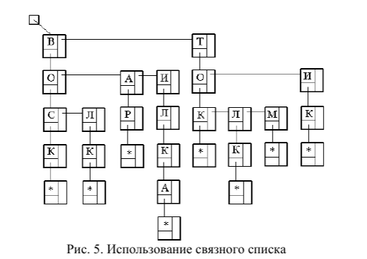

# **Лаборатоная работа №4   Тема: Цифровой поиск**

## ***Вид дерева цифрового поиска***  
 

---

## ***Реализация дерева через односвязанные списки***  
 

---

## ***Задание***  
> ### Написать программу, реализующую алгоритм цифрового поиска. Обязательно должны быть реализованы функции добавления нового слова и поиска слова в дереве. На форме должен присутствовать список введенных в дерево слов. Предусмотреть процедуру освобождения занимаемой деревом памяти.